# Agentic Design & Causal Intelligence — Design Deep-Dive

A focused, plain-language design document for the two "brains" of Lakshya:

- **Part 1 — Agentic Design:** how *Lakshya*, the AI research analyst, answers questions.
- **Part 2 — Causal Intelligence:** how the system predicts domino effects (an event → which stocks move).

Each part has detailed design diagrams and a step-by-step explanation.

---

---

# Part 1 — Agentic Design ("Lakshya")

## 1.1 The idea in one sentence

> Lakshya is a research analyst built as a **graph of steps**. For every question it first decides *"is this a quick lookup or a hard question?"* and then takes one of two routes — a **fast assembly line** or a **thinking loop** — before writing one grounded, streamed answer.

This is called a **hybrid supervisor**: a router (the supervisor) picks the strategy, and both strategies end at the same writer.

Why hybrid? Two extremes are both bad:

- *Always* run a slow multi-step agent → expensive and slow for "what's TCS's P/E?"
- *Always* run a fixed pipeline → too rigid for "should I rebalance given rising crude?"

So Lakshya routes each query to the cheapest strategy that can answer it.

## 1.2 The whole graph

Lakshya is a single **LangGraph `StateGraph`** (`src/agents/graph.py`). Five nodes, two paths:

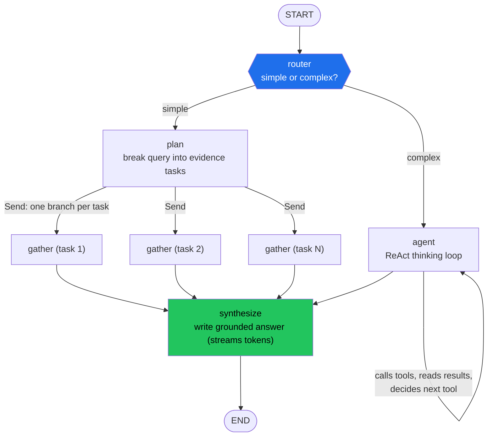

The graph is **compiled with a Postgres checkpointer**, so each conversation (`session_id`) is remembered across turns.

## 1.3 What flows through it: the shared "state"

Every node reads and writes one shared object, `ResearchState` (`src/agents/state.py`). Think of it as the analyst's desk that all steps share:

| Field                                                        | Meaning                                                |
| ------------------------------------------------------------ | ------------------------------------------------------ |
| `query`                                                    | the user's question                                    |
| `user_id`, `portfolio_id`, `company_id`, `upload_id` | who's asking / what it's about (for scoping tools)     |
| `route`                                                    | the router's decision:`simple` or `complex`        |
| `tasks`                                                    | (fast path) the list of evidence tasks to run          |
| `evidence`                                                 | results collected by workers/specialists (append-only) |
| `context_note`                                             | extra hint carried into the agent loop                 |

`evidence` uses a **reducer** so parallel branches can each append their findings without overwriting each other.

## 1.4 Node-by-node (plain English)

### ① router — "quick lookup or hard question?"

`_router` asks the LLM to label the query `simple` or `complex`:

- **simple** = one fact / one metric / one company / a definition (e.g. *"What's Infosys's ROE?"*).
- **complex** = needs judgement or multiple steps (e.g. *"Should I trim my IT exposure given the rupee move?"*, *"Compare HDFC vs ICICI and give a verdict"*).

If the LLM call fails, it falls back to **keywords** (`should i`, `rebalance`, `recommend`, `vs`, `compare`, `strategy`, …). It emits a `routing` stage event and stores `route`.

### ② plan — the fast assembly line (simple path)

`_plan` calls `ResearchPlanner` (`src/domains/chat/research_pipeline.py`), which turns the query into a small set of **evidence tasks** from a fixed menu of intents:

`company` · `news` · `filings` · `portfolio` · `thematic` · `causal` · `web`

Example: *"latest news and filings on Reliance"* → `[news, filings]`. It emits a `planning` then `evidence` stage (with the task kinds).

### ③ gather — run tasks in parallel (`Send` fan-out)

`_route_to_workers` uses LangGraph's `Send` to spawn **one parallel `gather` branch per task**. Each `_gather` runs exactly one task via the proven `ResearchWorkerPool._execute_task` (e.g. fetch news, RAG-search filings, compute portfolio metrics) and appends a result to `evidence`. Emits `evidence_item` per task.

This is the "assembly line": known steps, run concurrently, fast.

### ④ agent — the thinking loop (complex path)

`_agent` is a **bounded ReAct loop**. The LLM is given the 7 specialist tools (`bind_tools(SPECIALIST_TOOLS)`) and, up to `MAX_AGENT_STEPS` times:

1. The LLM looks at the question + everything gathered so far and **decides which specialist(s) to call** (or stops).
2. Each chosen specialist runs; its result is fed back as a `ToolMessage`.
3. The LLM uses that to decide the **next** move — call another specialist, or finish.

This is "reason → act → observe → repeat" — the model *chooses its own path* instead of following a fixed plan. It's scoped with `user_id`/`portfolio_id` so tools only touch the caller's data. Emits `reasoning` then a `specialist` event per tool call.

### ⑤ synthesize — write the answer (both paths end here)

`_synthesize` takes **only the gathered `evidence`** and asks the LLM to write the final answer, **grounded** in that evidence (this is the anti-hallucination guard — it answers from fetched facts, not memory). Tokens **stream** out (`stream_mode="messages"`) so the UI types the answer live. Emits `synthesizing`.

## 1.5 The 7 specialists and their tools

Specialists (`src/agents/specialists.py`) are the analyst's "team". Each is a LangChain tool that bundles lower-level tools (`src/agents/tools/`):

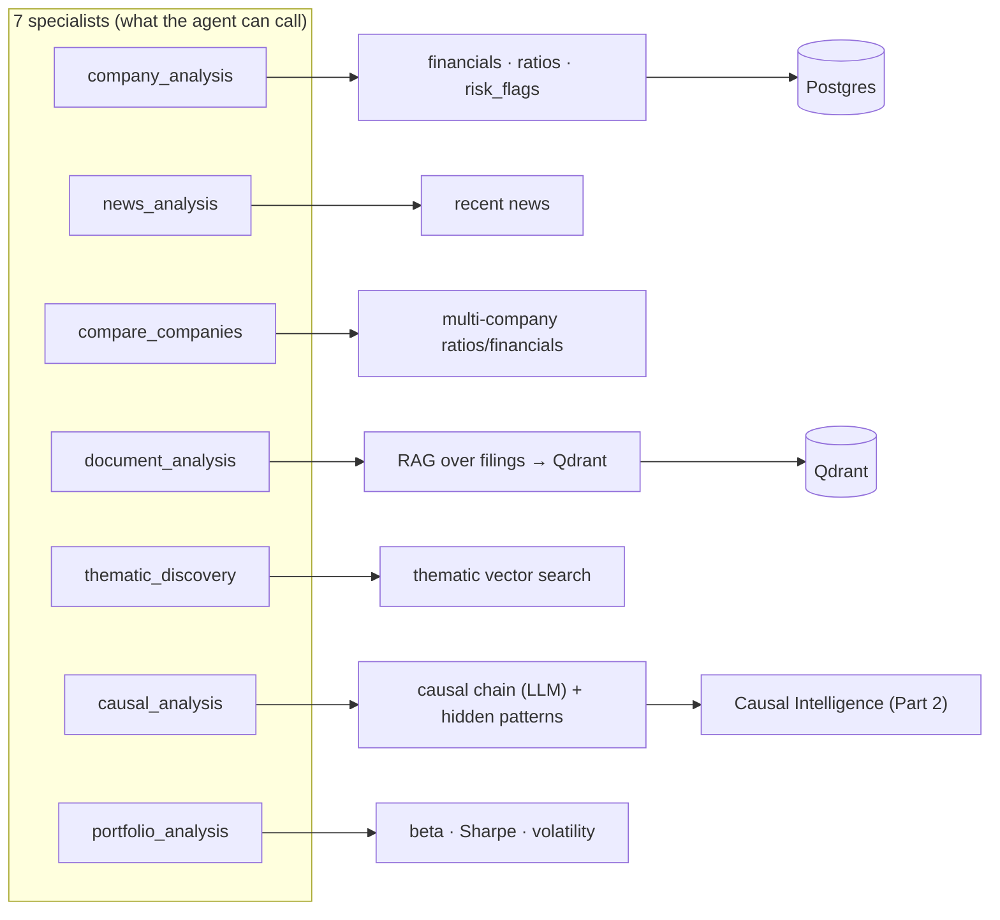

| Specialist             | Answers questions like                                             |
| ---------------------- | ------------------------------------------------------------------ |
| `company_analysis`   | "How healthy is TCS?" (financials + ratios + red flags)            |
| `news_analysis`      | "What's the latest on Infosys?"                                    |
| `compare_companies`  | "HDFC vs ICICI on margins"                                         |
| `document_analysis`  | "What did Reliance say about refining margins?" (searches filings) |
| `thematic_discovery` | "Which stocks fit the EV supply-chain theme?"                      |
| `causal_analysis`    | "What happens to my stocks if crude spikes?"                       |
| `portfolio_analysis` | "How risky is my portfolio?"                                       |

## 1.6 Two worked examples

**Simple query — "What is HDFC Bank's ROE?"**

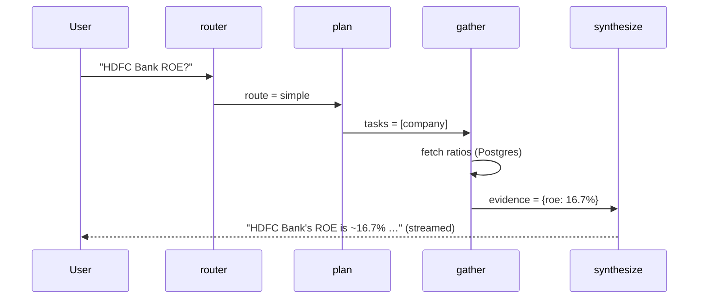

**Complex query — "Should I trim IT given the rupee move?"**

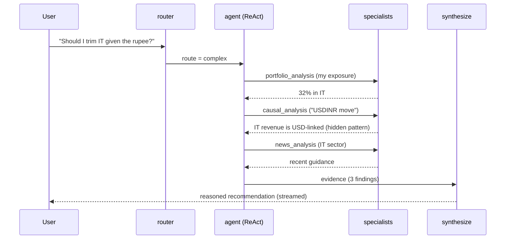

## 1.7 Cross-cutting: guardrails, memory, streaming

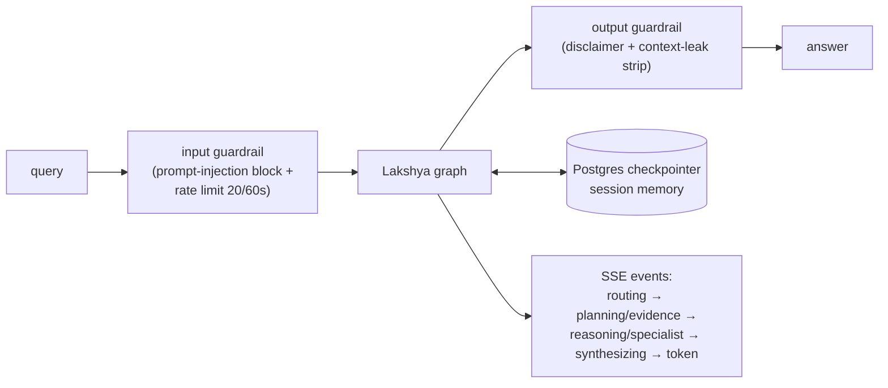

- **Guardrails** (`src/agents/guardrails.py`): block prompt injection on the way in, add disclaimers and strip any leaked context on the way out, and rate-limit per user (Redis sliding window).
- **Memory:** the Postgres checkpointer persists graph state per `session_id`, so follow-up questions keep context.
- **Streaming:** the API (`POST /chat/query/stream`) emits Server-Sent Events — `stage` (which node is running), `token` (answer text), `done`/`error` — which the frontend renders as a live stage-stepper + typed answer.

## 1.8 Why this design works

- **Cheap when it can be, smart when it must be** — the router keeps 90% of lookups on the fast path.
- **Grounded** — the answer is written only from freshly gathered evidence, reducing hallucination.
- **Composable** — adding a capability = adding one specialist tool; the agent discovers it automatically via `bind_tools`.
- **Observable** — every step is a named stage streamed to the UI and traced in SigNoz.

---

---

# Part 2 — Causal Intelligence

## 2.1 The idea in one sentence

> Causal Intelligence answers *"if **this** happens in the world, **which of my stocks** move, and why?"* by walking a graph of cause-and-effect links: **event → commodity → sector → company**, with each link scored by how much real price history agrees with it.

Example the system is built to explain:

> *Crude oil spikes → aviation & paint input costs rise → those sectors' margins compress → these specific stocks in your portfolio are exposed.*

## 2.2 The mental model: a graph of edges

The core data is a set of **edges** connecting things that move together. Two edge types (`src/db/models.py`):

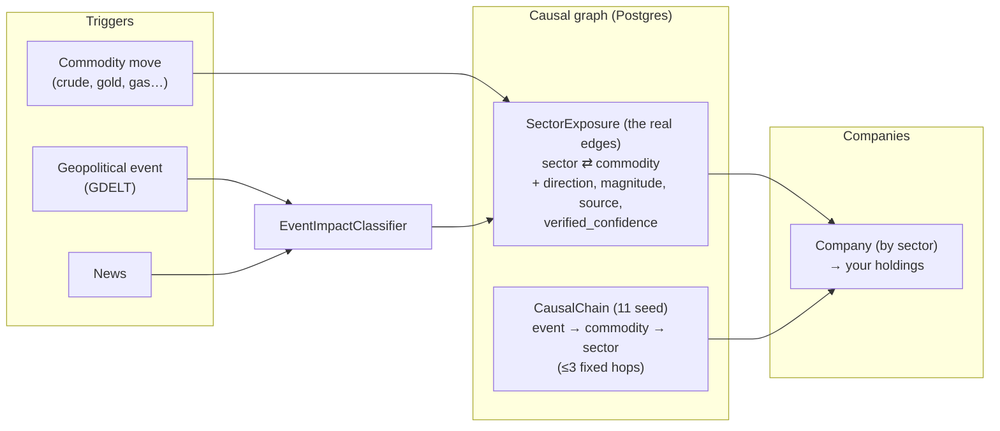

- **`SectorExposure`** — the workhorse "edge" table. One row = *"Sector X depends on Commodity Y, in direction ± , with magnitude M"* plus provenance and a **verified confidence** learned from price data.
- **`CausalChain`** — 11 hand-seeded, human-readable stories with up to 3 hops (event → commodity → sector). Good for the "Domino Effect" UI storytelling.

## 2.3 Where edges come from (four sources)

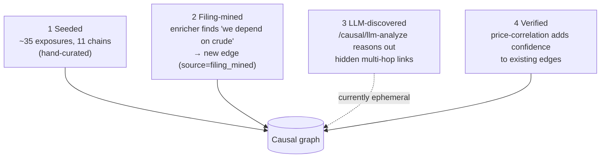

1. **Seeded** (`src/etl/seed_causal_data.py`) — the starting knowledge: 11 chains, ~35 sector→commodity exposures, a commodity list, and a ticker→sector map.
2. **Filing-mined** (`src/etl/causal_graph_miner.py`, daily) — the document enricher extracts `causal_signals` (e.g. "input-cost sensitivity to natural gas"); the miner turns those into new `filing_mined` edges. *(This is how the graph is meant to grow — it needs a real document corpus.)*
3. **LLM-discovered** (`/causal/llm-analyze`) — for a given trigger the LLM reasons out primary + hidden multi-hop impacts, grounded to real DB sectors so it can't invent them. *(Today this output is shown but not saved back — a known gap.)*
4. **Verified** (below) — doesn't create edges, it **scores** them with real market data.

## 2.4 Event → impact: how a trigger propagates

There are two propagation paths (`src/domains/causal/`, `src/services/causal_service.py`):

**Path A — deterministic (commodity → sector → company):**

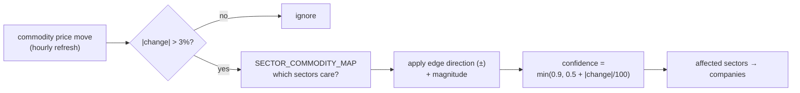

**Path B — event/news:** `EventImpactClassifier` (`src/integrations/event_impact_classifier.py`) maps a headline/event to affected sectors & commodities using keyword patterns (with an LLM variant constrained to known sectors), and writes `GeopoliticalEvent` rows.

> **Design note / current limit:** Path A and Path B are surfaced as *parallel feeds* today — the classifier's affected sectors aren't yet walked through `SectorExposure`/`CausalChain` down to *specific companies*. Wiring that join (event → chain → company) is the top causal improvement on the roadmap.

## 2.5 The verification layer — "does the market agree?"

Seeded/mined edges are *hypotheses*. The verifier (`src/services/causal_verification.py`, daily) checks each against reality:

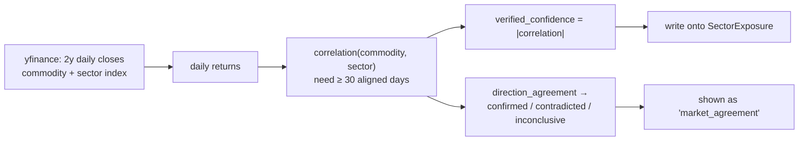

Plain English: *"We said metals depend on copper. Over 2 years, do metal-index moves actually track copper moves? If yes → high confidence + 'confirmed'. If they move opposite → 'contradicted'."* This turns opinions into **evidence-scored** edges.

**Honest coverage gap:** only ~8 of 12 commodities and ~13 sectors have a market proxy, so edges like *Aviation→jet fuel* or *Sugar→sugar* stay **unverified** (confidence = null) until proxies are added.

## 2.6 Worked example — "Crude oil jumps 6%"

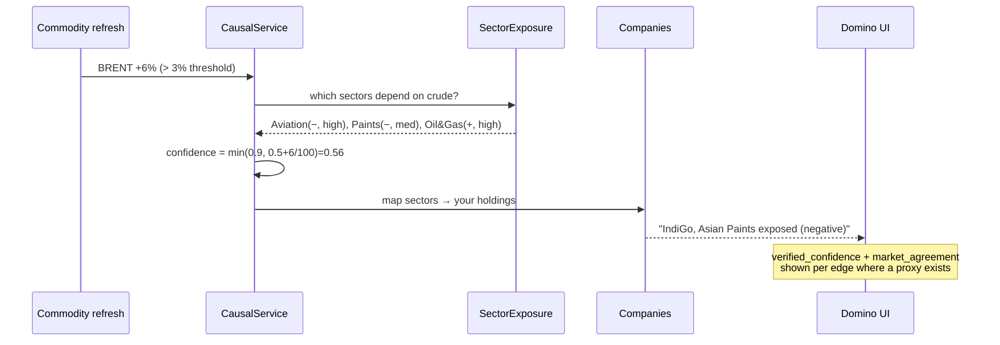

## 2.7 Data model reference

| Table                 | Role                            | Key fields                                                                                                                                                                         |
| --------------------- | ------------------------------- | ---------------------------------------------------------------------------------------------------------------------------------------------------------------------------------- |
| `CausalChain`       | seed storylines (≤3 hops)      | `trigger_type/value`, `hop1..3_{type,target,relationship}`, `confidence`                                                                                                     |
| `SectorExposure`    | the causal edges                | `sector`, `commodity`, `impact_direction`, `impact_magnitude`, `source` (seed/filing_mined), `verified_correlation`, `verified_confidence`, `verified_sample_size` |
| `PriceHistory`      | verification input              | `symbol`, `series_type` (commodity/sector_index), `price_date`, `close`                                                                                                    |
| `CommodityPrice`    | live spot prices                | `symbol`, `price`, `change_pct`, `source`                                                                                                                                  |
| `GeopoliticalEvent` | classified events               | `event`, `affected_sectors`, `goldstein/impact`                                                                                                                              |
| `CausalInsight`     | per-portfolio generated insight | TTL-expiring                                                                                                                                                                       |

## 2.8 How the two brains connect

Causal Intelligence isn't separate from the agent — it's one of Lakshya's specialists:

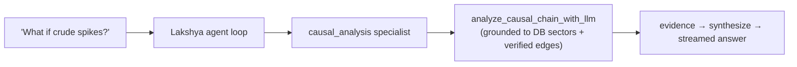

And the document pipeline feeds the causal graph: the **enricher's `causal_signals` → the miner → new edges → verified over time**. A richer document corpus therefore makes *both* the answers and the causal graph smarter — which is why growing the corpus is the shared priority.

## 2.9 Current limits & how it grows

- **Mostly seed today** (11 chains, 35 exposures, 4 mined) — grows as real filings/concalls are ingested and mined.
- **Single-shape mining** (only input-cost/negative edges) and **fixed coverage maps** — widening these adds breadth.
- **Event→company join and LLM-edge persistence** are the two highest-impact upgrades: they connect world events to *your* specific stocks and let the graph learn from its own reasoning.

---

*Companion to `ARCHITECTURE.md`. Update alongside changes to `src/agents/` or `src/domains/causal/`.*
