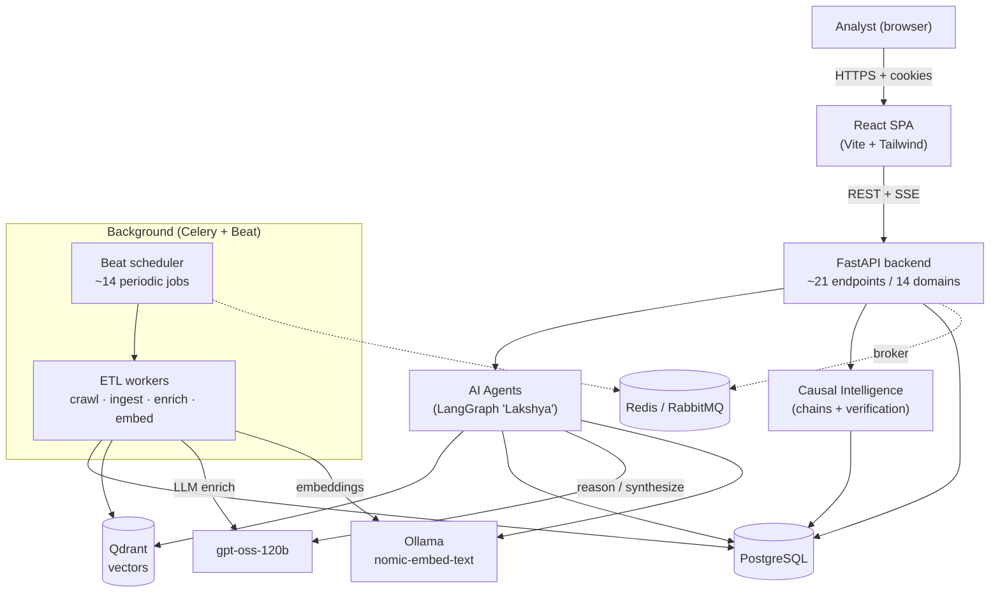
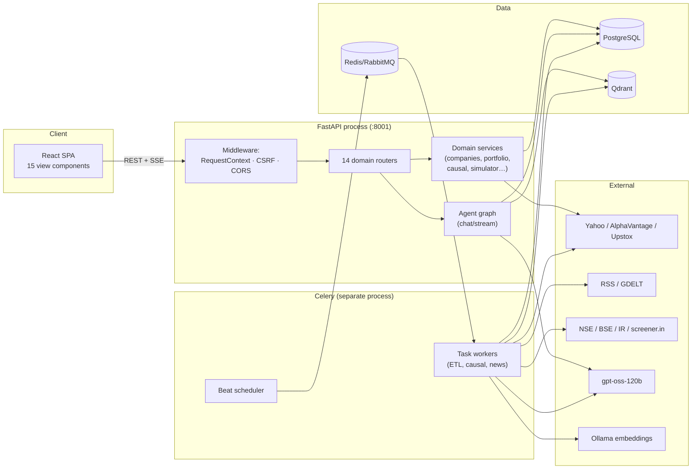
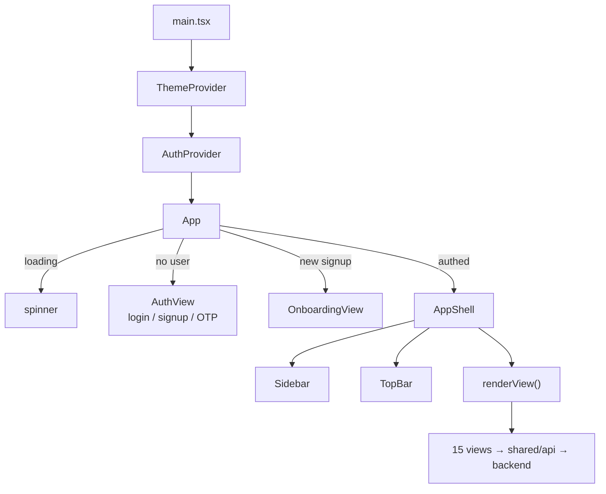
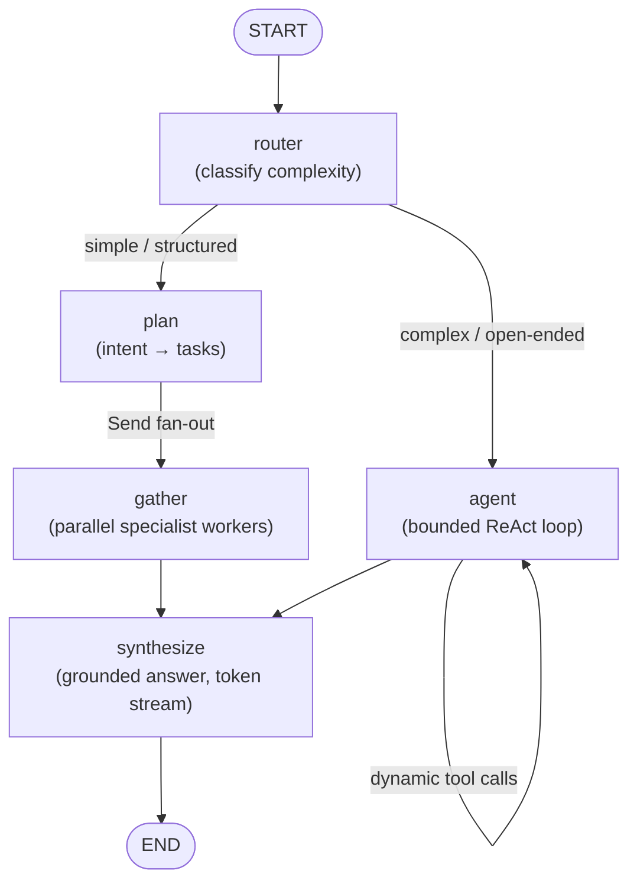
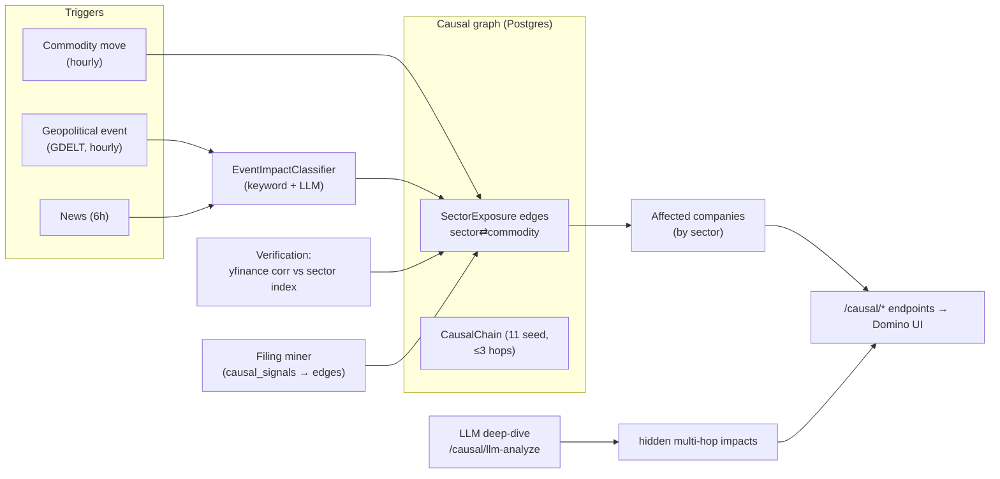
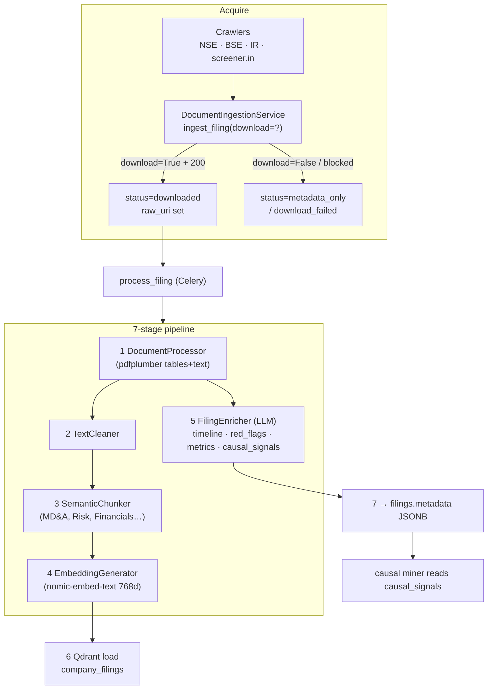
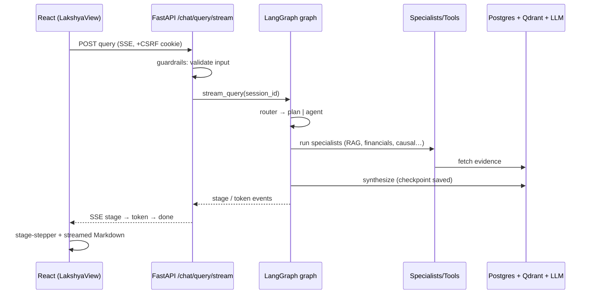

# Lakshya — System Architecture

An AI-native equity-research platform for Indian markets. It ingests filings, news, and market data 24/7; runs a multi-agent LLM research pipeline; tracks predictive "domino-effect" causal chains across sectors and commodities; and serves it all through a streaming React console.

> **Scope of this doc:** end-to-end architecture — Frontend → Backend API → AI Agents → Causal Intelligence → ETL → Data Stores — with diagrams and the request/data flows that tie them together.

---

## Table of Contents
1. [System at a glance](#1-system-at-a-glance)
2. [Technology stack](#2-technology-stack)
3. [High-level architecture](#3-high-level-architecture)
4. [Frontend](#4-frontend)
5. [Backend API](#5-backend-api)
6. [AI Agent layer](#6-ai-agent-layer)
7. [Causal Intelligence](#7-causal-intelligence)
8. [ETL pipeline](#8-etl-pipeline)
9. [Data stores & schema](#9-data-stores--schema)
10. [End-to-end flows](#10-end-to-end-flows)
11. [Current state & known gaps](#11-current-state--known-gaps)

---

## 1. System at a glance

Four cooperating subsystems around shared data stores:

- **Data Gatherer (ETL)** — Celery workers crawl the exchanges/IR pages, fetch news & market data, process documents through a 7-stage pipeline, and load vectors into Qdrant.
- **AI Brain (Agents)** — a LangGraph hybrid-supervisor graph ("Lakshya") routes each query to a fast workflow or an agentic specialist loop, then streams a grounded answer.
- **Causal Intelligence** — a graph of event → commodity → sector → company edges, mined from filings + verified against real price correlations.
- **Console (Frontend)** — a Vite/React/TypeScript SPA with 14 views, streaming chat, and light/dark theming.



---

## 2. Technology stack

| Layer | Technology |
|---|---|
| **Frontend** | Vite + React + TypeScript, Tailwind CSS v3 (CSS-variable theming, light/dark), Recharts, react-markdown, Material Symbols |
| **API** | FastAPI (Python), Pydantic schemas, SQLAlchemy ORM |
| **Auth** | Email-OTP + password (PBKDF2), JWT session cookies (HttpOnly) + CSRF double-submit cookie |
| **Agents** | LangGraph `StateGraph`, LangChain tools; Postgres checkpointer for session memory |
| **LLM** | `openai/gpt-oss-120b` (OpenAI-compatible endpoint); Groq `llama-3.3-70b` fallback |
| **Embeddings** | Ollama `nomic-embed-text` (768-dim) |
| **Vector DB** | Qdrant (`company_filings`, `user_uploads` collections, cosine) |
| **Relational DB** | PostgreSQL (SQLAlchemy + Alembic migrations) |
| **Async** | Celery workers + Beat scheduler; Redis / RabbitMQ broker |
| **Market/News data** | Yahoo Finance (quotes/history), Alpha Vantage, Upstox instrument master, GDELT (geopolitical), RSS (news), FinBERT (news sentiment) |
| **Observability** | OpenTelemetry → SigNoz (traces) |

---

## 3. High-level architecture



**Two runtime processes** share Postgres/Qdrant: the FastAPI API (synchronous request/response + streaming) and the Celery worker+beat (asynchronous ingestion). They are decoupled via the broker; the API can also fall back to inline threads when Celery is unavailable.

---

## 4. Frontend

**Stack:** Vite + React + TypeScript + Tailwind v3. Theme tokens are CSS variables swapped by a `.dark` class, so every component is light/dark aware from one set of utility classes.

### Structure (`frontend/src/`)

```
main.tsx ─ ThemeProvider ▸ AuthProvider ▸ App
App.tsx  ─ auth gate → AuthView | OnboardingView | AppShell(renderView)
routes.ts ─ ViewKey union + NAV[] (sidebar groups: main/research/tools/footer)

components/
  shell/  AppShell · Sidebar (collapsible) · TopBar (search, theme, profile)
  ui.tsx  Card · CardHeader · StatTile · Chip · buttons · Skeleton
  Icon · Markdown · CompanySearch (debounced typeahead)

lib/
  auth.tsx   AuthProvider + useAuth (session restore via /auth/me)
  theme.tsx  ThemeProvider + useTheme
  user.ts    getUserId() → authenticated id (per-user isolation)
  api.ts     barrel re-export of shared/api/*
  format.ts  INR / %, timeAgo

shared/api/  core (fetch + CSRF + SSE) · auth · platform · external · user
shared/types/api.ts  all response DTOs
```

### Views (15)
Dashboard · Lakshya (streaming chat) · Discovery (thematic) · Company workspace · Compare · Portfolio · Watchlist · Domino Effect (causal) · Filings · News · Simulator (paper trading) · Profile · Settings · Auth · Onboarding.

### Cross-cutting concerns
- **Auth gate:** `App` blocks the shell until `/auth/me` resolves; unauthenticated → `AuthView` (login / signup / OTP), brand-new signups → `OnboardingView` (expertise). Logout lives in the sidebar footer.
- **Per-user isolation:** `getUserId()` returns the authenticated id (no hardcoded demo user); every request is scoped to the signed-in account.
- **Streaming:** chat surfaces consume SSE via `postSse`/`getSse` with a `ChatStreamHandlers` shape — `onStage(stage, detail)`, `onToken(text)`, `onDone`, `onError` — driving a stage-stepper UI while tokens render into Markdown.
- **Security:** all mutating requests send the `X-CSRF-Token` header read from the `csrf_token` cookie; `credentials: "include"` on every call.



---

## 5. Backend API

**FastAPI**, ~21 endpoints across **14 domain routers**, each a self-contained `routes → service → models` slice.

### Middleware chain (`src/app/`)
```
Request ▸ RequestContextMiddleware (correlation id, timing)
        ▸ CSRFMiddleware (double-submit cookie check on mutating verbs; exempt: auth bootstrap)
        ▸ CORSMiddleware (credentialed; localhost:5173 in dev)
        ▸ Router → Service → SQLAlchemy → PostgreSQL
```

### Domains & routers

| Prefix | Domain | Responsibility |
|---|---|---|
| `/auth` | auth | Email-OTP + password login/register/demo, JWT+CSRF cookies, `/me`, profile |
| `/companies` | companies | Universe, detail, quote, financials, ratios, filings, historical prices, search |
| `/portfolios` | portfolio | Portfolios, holdings CRUD, risk metrics, AI suggestions (SSE) |
| `/compare` | compare | Two-company LLM comparison verdict |
| `/screens` | screens | Thematic (vector) discovery + saved screens |
| `/causal` | causal | Market/portfolio/company causal graph, LLM analysis |
| `/simulator` | simulator | Paper trading: trade, positions, history, gamified stats |
| `/watchlists` | watchlists | Watchlist CRUD |
| `/timeline` | timeline | Company/user event timeline |
| `/news` | news | `/get-news` — RSS aggregation + FinBERT sentiment |
| `/users` | users | Balance top-up, transactions, KYC |
| `/chat` | chat + upload | **Streaming research** (`/chat/query/stream`), sessions, doc upload |
| `/profiles` | profiles | App profile persistence |
| `/alerts` | alerts | (Backend present; UI removed) |

### Auth model
Passwordless **email-OTP** and **email+password** (PBKDF2-SHA256, stdlib) both converge on `create_session()` → sets **HttpOnly** `access_token`/`refresh_token` cookies **and** a JS-readable `csrf_token` cookie. The demo account (`/auth/demo`) issues the same cookies for one-click access. New users are auto-provisioned with a default portfolio (`ensure_default_portfolio`).

---

## 6. AI Agent layer

"Lakshya" is a **single LangGraph `StateGraph`** implementing a **hybrid supervisor**: a router picks between a deterministic *fast workflow* and an *agentic specialist loop*, and both converge on a shared streaming `synthesize` node. Compiled with the **Postgres checkpointer** so sessions persist across turns.



### Router → two paths
- **Fast workflow** (`plan` → `gather`): the intent planner (`research_pipeline.py`, intents = *news, filings, portfolio, thematic, causal, web*) turns a query into structured tasks, fanned out with LangGraph `Send` and gathered in parallel via `_run_*_snapshot` helpers. Deterministic, cheap, low-latency.
- **Agentic loop** (`agent`): a bounded ReAct loop where the LLM dynamically calls specialist tools until it has enough evidence. Flexible, for multi-step/open-ended questions.

### The 7 specialists (`src/agents/specialists.py`)
| Specialist | Wraps |
|---|---|
| `company_analysis` | financials + ratios + risk flags (`tools/financial.py`) |
| `news_analysis` | recent company news (`tools/news.py`) |
| `compare_companies` | multi-company ratios/financials |
| `document_analysis` | RAG over filings (`tools/vector_search.py` → Qdrant) |
| `thematic_discovery` | thematic vector search across the corpus |
| `causal_analysis` | LLM causal-chain analysis + hidden patterns (`tools/causal_tools.py`) |
| `portfolio_analysis` | beta/Sharpe/volatility over holdings (`tools/portfolio.py`) |

Lower-level tools live in `src/agents/tools/` (financial, news, portfolio, causal, vector_search, document, company_resolver, web_search, performance).

### Guardrails, memory, streaming
- **Guardrails** (`src/agents/guardrails.py`): input prompt-injection block, output disclaimer + context-leak strip (idempotent), Redis sliding-window rate-limit (20/60s) → `GuardrailError` → HTTP.
- **Memory:** LangGraph Postgres checkpointer + store (`src/agents/memory.py`), keyed by `session_id`.
- **Streaming:** `synthesize` streams tokens (`stream_mode="messages"`); `ChatService.stream_query` emits SSE events `stage → token → done/error` over `POST /chat/query/stream`.

---

## 7. Causal Intelligence

Predicts how a world/market event cascades: **event → commodity → sector → company**. Seeded today, mined from filings, and verified against real price correlations.



### Components
- **Models** (`src/db/models.py`): `CausalChain` (denormalized ≤3-hop rows), `SectorExposure` (the real edge table: sector/commodity/direction/magnitude + `source` seed|filing_mined and `verified_correlation/confidence/sample_size`), `PriceHistory`, `CommodityPrice`, `GeopoliticalEvent`, `CausalInsight`.
- **Seeding** (`src/etl/seed_causal_data.py`): 11 chains, ~35 sector exposures, ~12 commodities, sector map.
- **Mining** (`src/etl/causal_graph_miner.py`, daily): reads filings' `causal_signals` → adds `filing_mined` sector→commodity edges.
- **Event classification** (`src/integrations/event_impact_classifier.py`): maps events → sectors/commodities (keyword patterns + LLM variant constrained to known sectors).
- **Verification** (`src/services/causal_verification.py`, daily): correlates commodity vs sector-index returns from yfinance → writes `verified_confidence`; `direction_agreement` surfaces `market_agreement`.
- **Serving** (`src/domains/causal/`): `/causal/market`, `/causal/portfolio/companies`, `/causal/company/{id}`, `/causal/llm-analyze`.

---

## 8. ETL pipeline

The data gatherer. A document travels **crawl → ingest (download) → 7-stage transform → load**, orchestrated by Celery.



### Celery beat schedule (auto-running jobs)

| Job | Cadence |
|---|---|
| `sync_stock_universe` | daily 06:00 |
| `enrich_companies` | daily 07:00 |
| `refresh_financials_batch` | daily 08:00 & 18:00 |
| `crawl_nse` / `crawl_bse` / `crawl_ir` | daily 09:30 / 09:00+15:00 / Sat 02:00 |
| `sync_news` | every 6h |
| `check_portfolio_news` | every 30 min |
| `refresh_commodity_prices` | hourly |
| `monitor_geopolitical_events` | hourly |
| `mine_causal_edges` | daily 08:30 |
| `backfill_price_history` | weekly (Sat 03:00) |
| `verify_causal_exposures` | daily 08:45 |

### Key modules
`src/etl/`: `crawler_{nse,bse,ir}.py`, `ingestion_service.py`, `tasks.py` (task registry), `transform_task.py` (7-stage orchestration), `document_processor.py`, `text_processor.py`, `embedding_generator.py`, `enricher.py`, `load_task.py`, `causal_graph_miner.py`, `event_monitor_task.py`, `news_sync_task.py`, `seed_causal_data.py`.

---

## 9. Data stores & schema

- **PostgreSQL** — source of truth. Core tables: `users`, `portfolios`, `holdings`, `companies` (~4,900), `exchanges`, `financial_statement_raw`, `financial_ratios`, `company_themes`, `filings` (+ `metadata` JSONB), `news_articles`, `simulated_trades` / `simulator_stats`, `watchlists`, causal tables (§7), `otp`, `user_sessions`, `user_transactions`. Alembic migrations under `alembic/versions/`.
- **Qdrant** — `company_filings` (768-dim cosine, per-chunk payload: `company_id`, `filing_id`, `section`, `text`), `user_uploads`.
- **Redis / RabbitMQ** — Celery broker/result backend + rate-limit windows.
- **Filesystem** — downloaded documents under `uploads/filings/`.

---

## 10. End-to-end flows

### A. A chat query (Lakshya)


### B. Filing ingestion → insight
`crawl_{nse,bse}` → `ingest_filing(download=True)` → (on `raw_uri`) `process_filing` → 7 stages → chunks embedded into Qdrant + enrichment (red flags/metrics/causal signals) into `filings.metadata` → `mine_causal_edges` consumes `causal_signals`.

### C. Causal event
`monitor_geopolitical_events` (hourly, GDELT) → `EventImpactClassifier` → `GeopoliticalEvent` rows; `refresh_commodity_prices` → `SectorExposure` traversal → `/causal/*` → Domino UI. `verify_causal_exposures` attaches real-correlation confidence daily.

---

## 11. Current state & known gaps

**Working end-to-end:** company universe (~4,900 auto-synced), quotes/financials/news/commodities/geopolitical feeds, portfolios + holdings + risk metrics, paper-trading simulator, the Lakshya streaming agent, and the seeded causal graph with market-correlation verification. Auth (OTP + password + demo) with per-user isolation.

**Gaps (documentation-honest):**
1. **Document corpus is thin** — acquisition is the bottleneck: the UI filing path downloads nothing (`download=False`), exchange archives bot-block downloads, and there is **no concall/transcript source**. Result: ~27 filings, ~14 processed, ~40 Qdrant chunks. The 7-stage pipeline *works when a document lands* — it just rarely lands.
2. **Extracted insights aren't surfaced** — the enricher's red flags/metrics/timeline go into `filings.metadata` JSONB that **no endpoint reads back**; only the causal miner consumes `causal_signals`.
3. **Causal graph is mostly seed** — 11 static chains; event-classifier output isn't yet joined to the stored graph to reach *specific companies*, and the LLM deep-dive's discovered edges are ephemeral (not persisted).
4. **Seed bootstrap is manual** — `seed_db.py` / `seed_causal_data.py` have no Celery task (operational data already auto-refreshes; only the one-time seed is hand-run).

> A phased plan to close gaps 1–4 (self-provisioning bootstrap, pluggable document acquisition incl. screener.in concalls, a queryable `CompanyInsight` table + Insights feed/company panel, and event→company causal wiring) is tracked separately.

---

*Generated as a living architecture reference. Update alongside structural changes.*
