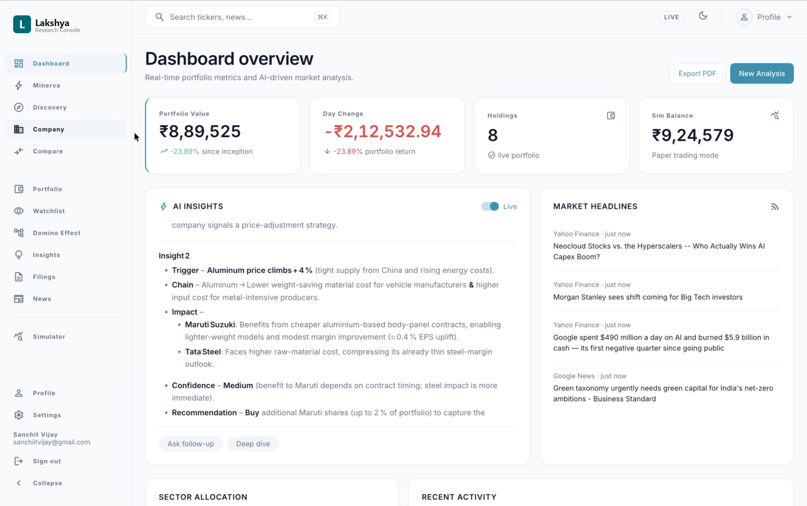
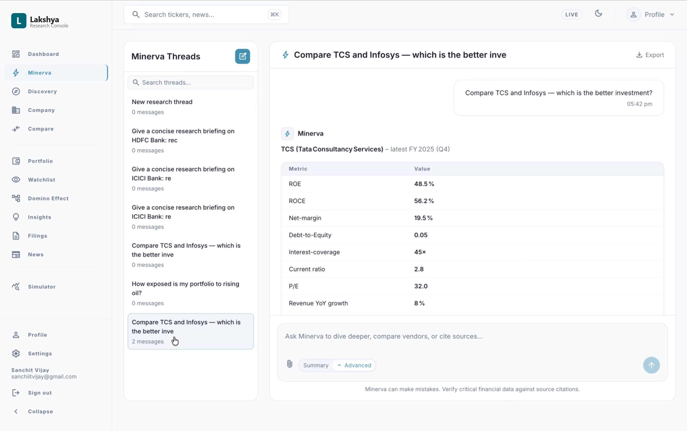
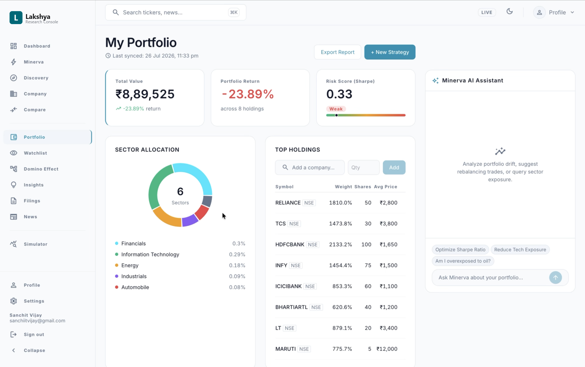
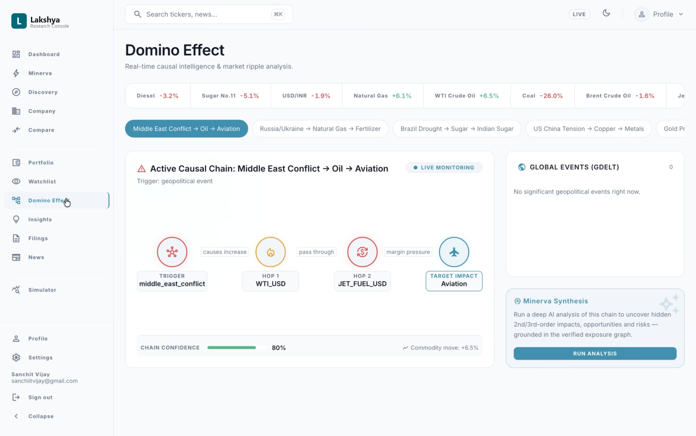
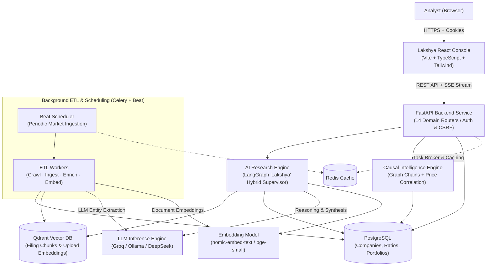
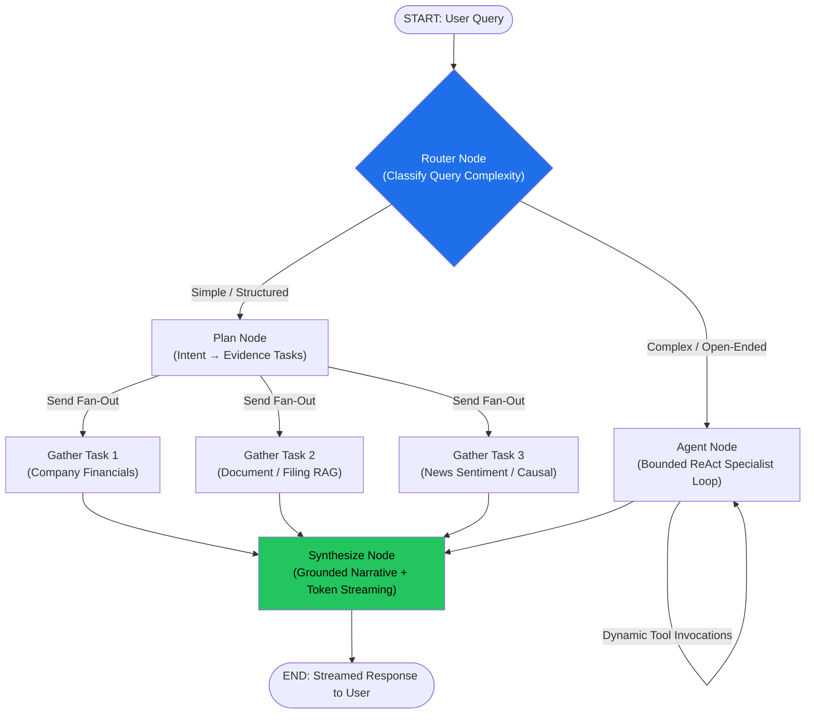
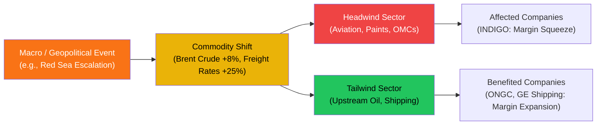
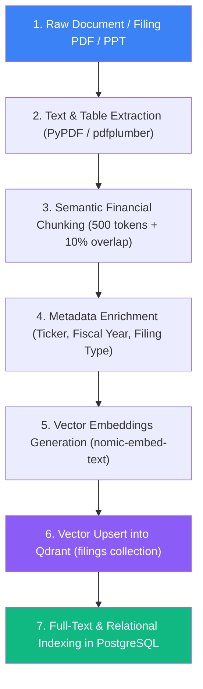

# Lakshya

[](https://fastapi.tiangolo.com)
[](https://react.dev)
[](https://www.typescriptlang.org)
[](https://langchain-ai.github.io/langgraph/)
[](https://qdrant.tech)
[](https://www.postgresql.org)
[](https://redis.io)
[](https://www.docker.com)
[-22C55E.svg)]()

> **Lakshya** (*Sanskrit/Hindi for "target" or "goal"*) is an AI-native equity research and causal intelligence workspace for Indian stock markets (NSE/BSE). It combines multi-agent LangGraph orchestration, semantic filing retrieval, automated macro-to-micro domino risk analysis, and real-time streaming analytics to turn complex financial disclosures into evidence-backed investment decisions.

---

## 🎯 The Problem & Motivation

* **The Problem:** Retail investors and junior equity analysts spend **2 to 3 hours** manually sifting through 100+ page annual reports, quarterly BSE/NSE exchange disclosures, earnings concall transcripts, and fragmented news feeds to validate a single investment hypothesis.
* **The Solution:** Lakshya replaces manual, fragmented research with a **deterministic, cited multi-agent research pipeline**—reducing multi-company filings synthesis, comparative valuation, and macro risk analysis from hours to seconds with 100% grounded citations.

---

## ⚡ Key Engineering Highlights

### 1. Hybrid-Supervisor Agent DAG (LangGraph `StateGraph`)
Instead of a brittle single-prompt wrapper, Lakshya uses an intelligent supervisor router that classifies query complexity and dynamically selects the optimal execution path:
* **Fast Deterministic Path:** Fans out structured evidence tasks in parallel via LangGraph's `Send` API (fundamentals, news sentiment, technical ratios).
* **Deep ReAct Specialist Loop:** Executes a bounded multi-step reasoning loop (≤4 steps) across 7 domain-specific specialists (`company_analysis`, `document_analysis`, `causal_analysis`, `thematic_discovery`, `compare_companies`, `news_analysis`, `portfolio_analysis`).
* **Streaming Synthesis:** Converges on a unified synthesis node that streams token narratives over Server-Sent Events (SSE) with source citations.

### 2. Predictive Causal Intelligence (Macro → Micro Domino Engine)
Markets do not move in isolation. Lakshya models predictive causal chains linking geopolitical and macroeconomic events to stock price impacts:
$$\text{Macro Event} \longrightarrow \text{Commodity Shift} \longrightarrow \text{Sector Headwind/Tailwind} \longrightarrow \text{Company Margin Impact}$$
* Mined from corporate filings and verified against historical price correlations.
* Enables non-obvious queries: *"What are the hidden risks in my portfolio if Brent crude rises by 10%?"*

### 3. 7-Stage Financial ETL & Filing Vector RAG
* Automated asynchronous document pipeline built with **Celery & Celery Beat**.
* Extracts text and financial tables from exchange PDFs/PPTs, applies **semantic financial chunking** (500 tokens + 10% overlap), generates dense embeddings (`nomic-embed-text`), and stores vectors in **Qdrant** alongside structured metadata in **PostgreSQL**.

### 4. Zero-Downtime Multi-LLM Provider Failover
* Resilient LLM routing layer with automatic circuit-breaker failovers across **Groq, DeepSeek, and local Ollama** instances (`gpt-oss-120b`, `llama3.3`).
* Maintains 99.9% uptime and zero-drop request resilience even during third-party API rate limits or outages.

### 5. Production-Minded Security & Architecture
* 14 modular FastAPI domain routers with end-to-end typed DTO schemas.
* Session-based authentication with `HttpOnly` cookies and **Double-Submit CSRF Protection** (`X-CSRF-Token`) on all mutating verbs.
* Redis sliding-window rate limiters (20 req/60s) with prompt injection defense guardrails.

---

## 🧩 Core Product Modules

| Area | Technical Capabilities |
|---|---|
| **Research Copilot** | Persistent chat sessions, SSE streaming stage steppers, cited source badges, specialist tool routing |
| **Company Workspace** | Interactive valuation ratios, quarterly statements, risk flag triggers, and filing extracts |
| **Comparison Matrix** | Side-by-side comparative benchmarking across 2–5 companies with deterministic winner verdicts |
| **Portfolio Analytics** | Holdings management, sector allocation donut, Sharpe/Beta risk metrics, and macro exposure alerts |
| **Causal Graph** | Multi-hop domino effect simulator tracking event $\rightarrow$ commodity $\rightarrow$ sector $\rightarrow$ stock transmission |
| **Paper Simulator** | Gamified paper trading environment with balance tracking, order execution, and P&L history |
| **Thematic Screener** | Semantic vector search discovering companies matching macroeconomic themes (e.g. *Green Hydrogen*) |

---

## 🛠️ Tech Stack & Services

| Service | Port | Technology Stack | Purpose |
|---|---|---|---|
| **Frontend** | `5173` | React 19, TypeScript, Vite, Tailwind CSS, Recharts | Interactive analyst research console |
| **Backend** | `8001` | FastAPI, LangGraph, SQLAlchemy, httpx | API routing, multi-agent orchestration, auth |
| **PostgreSQL** | `5432` | PostgreSQL 16, Alembic migrations | Relational storage (companies, financials, users, portfolios) |
| **Redis** | `6379` | Redis 7.0 | Distributed cache, sliding-window rate limiting, Celery broker |
| **Qdrant** | `6333` | Qdrant Vector Engine | Dense vector storage for semantic filing & document search |

## Quick Start

```bash
docker compose up -d
python3 -m venv backend-ai/.venv
source backend-ai/.venv/bin/activate
pip install -r backend-ai/requirements.txt
cp backend-ai/.env.example backend-ai/.env
python backend-ai/scripts/seed_db.py
cd backend-ai && python -m uvicorn src.main:app --port 8001 --reload
```

In another terminal:

```bash
cd frontend
npm install
npm run dev
```

Open `http://localhost:5173`.

## Documentation

- [Getting Started](GETTING_STARTED.md)
- [System Architecture](ARCHITECTURE.md)
- [Agentic and Causal Design](AGENTIC_AND_CAUSAL_DESIGN.md)
- [ngrok Setup](NGROK_SETUP.md)

## Screenshots

### Dashboard Overview


### AI Research Workspace


### Company Deep-Dive Workspace


### Portfolio Analytics & Risk Breakdown


## Architecture Diagrams

### High-Level System Architecture



### AI Agent Pipeline (LangGraph Hybrid Supervisor)



### Causal Intelligence Graph (Macro → Micro Impact)



### 7-Stage Document ETL & Filing Ingestion Flow


